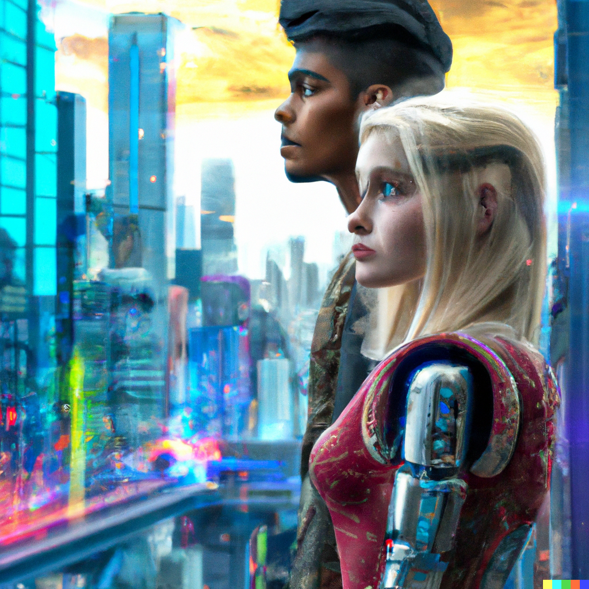

Once upon a time, in the dense jungles of the Indian wilderness, there lived a young boy named Mowgli. Mowgli had grown up among the animals, learning their ways and surviving on his own.

One day, while exploring the jungle, Mowgli stumbled upon a strange machine. He had never seen anything like it before and, with his curious nature, he couldn't resist investigating. He stepped into the machine and, with a bright flash of light, he was transported to the year 2200.

Mowgli found himself in the bustling metropolis of Night City, a place unlike anything he had ever seen before. The tall buildings and bright lights were overwhelming, but Mowgli was determined to explore this new world.

As he wandered the streets, he came across an android named Sofia. She was a highly advanced AI, designed to look and act like a human. Mowgli was fascinated by her, and they quickly became friends.

Sofia showed Mowgli around Night City, introducing him to the many wonders of this futuristic world. They rode in flying cars, visited virtual reality worlds, and even went on a thrilling adventure through the city's neon-lit streets.

Despite the many differences between their worlds, Mowgli and Sofia found that they had much in common. They both loved to explore and have new experiences, and they quickly formed a bond of friendship.

As their adventure came to an end, Mowgli realized that it was time for him to return to his own world. He stepped back into the machine that had brought him to Night City, and with a bright flash of light, he was transported back to the jungle.

Although he missed his new friend Sofia and the exciting world of Night City, Mowgli knew that he would always treasure the memories of their adventures together.

&#45; text generated by <a href='https://chat.openai.com/' target='_blank'>ChatGPT</a> with the following prompt: 'write a short story about mowgli time traveling into the year 2200 and meeting an AI android called sofia, and their adventures in night city'

&#45; audio generated by [eleven labs](http://www.elevenlabs.io/) with the following voice: conversational/Bella (American, soft)

&#45; art generated with [dall-e](https://openai.com/dall-e-2/) with the following prompt: 'a photo of an indian boy with a blonde android robot girl friend looking over a futuristic cyberpunk city'
